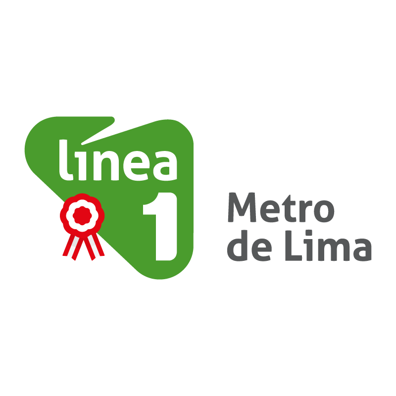

<b>RECARGAS DE SALDO ONLINE LINE 1 DEL METRO DE LIMA </color></b>

> Resumen del sistema

La consigna a desarrollar con este sistema, es realizar un proceso unificado para el desarrollo del sistema, para así evitar contactos más frecuentes entre personas y pasar al nivel de interactuar hombre máquina. 
Como objetivo principal del proyecto a realizar, es la reducción del tiempo en la recarga de las tarjetas y evitar las largas colas que se realizan día a día en todo el transcurso de la hora. Asimismo, con esta aplicación, evitaríamos aglomeraciones en la espera del tren, ya que cada usuario sabrá con exactitud a qué hora pasará la línea 1 en las estaciones elegidas.   
En síntesis, en este proyecto desarrollamos una propuesta que busca optimizar dichos procesos, aplicando los conocimientos adquiridos en las clases de Modelamiento para Objetos en un entorno y caso real a través del diseño y desarrollo de una aplicación en el lenguaje de programación e interfaz gráfica.

## Code insights

## Equipo

> Contribuyentes

| <a target="_blank">**Julio Rojas**</a> | <a target="_blank">**Merly Sifuentes**</a> | <a target="_blank">**Marco Velazquez**</a> ||
| :---: | :---:| :---:| :---:|
|  |  |  | |
| <a href="https://github.com/julioarteta" target="_blank">`github.com/JulioRojasArteta`</a> | <a href="https://github.com/Merlysifuentes" target="_blank">`github.com/MerlySifuentes`</a> | <a href="https://github.com/MarcoVelazquez" target="_blank">`github.com/MarcoVelazquez`</a> | |
